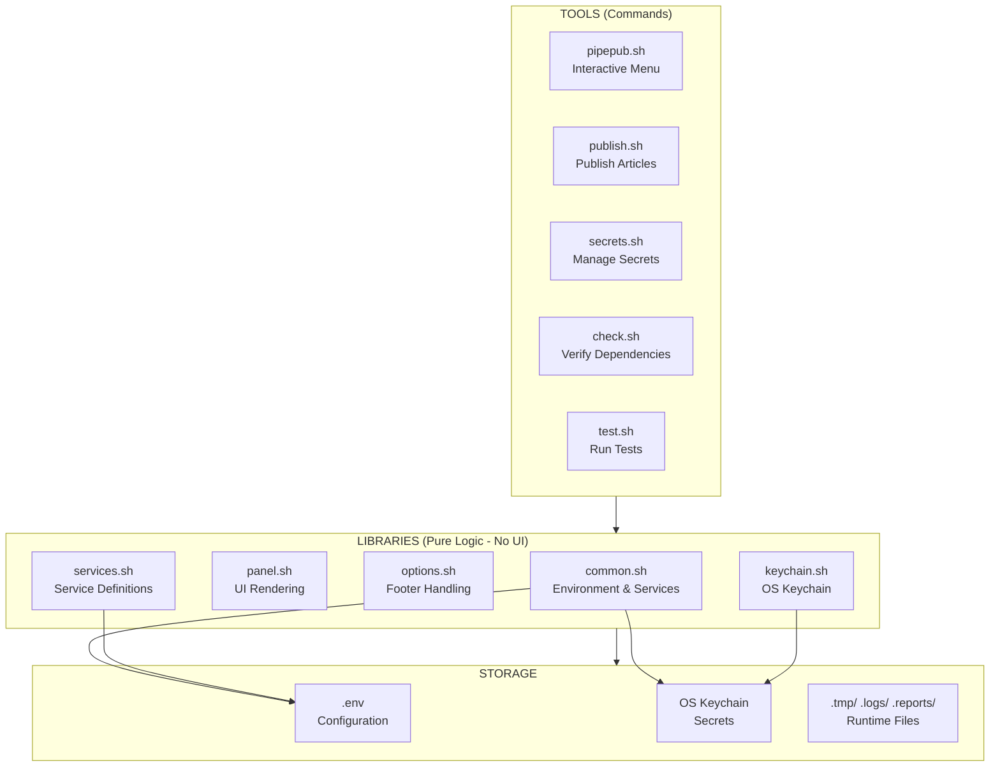

<a id="top"></a>

[](https://github.com/pipepub "PipeHub - Publish like a PRO")

### Technical Reference

> *Architecture, libraries, naming conventions, and fast lookups*

<hr>

<details>
<summary>ℹ️ <b>Information</b></summary>

| Info | Details |
|------|---------|
| **Name** | [](https://github.com/pipepub "PipePub - Publish like a PRO") |
| **Package** |  |
| **Version** | [](/CHANGELOG.md#history "PipePub v.1.0.0") |
| **DOC** | [](/docs/advanced/reference.md "Technical reference") |
| **License** | [](/LICENSE "Free MIT license") |

</details>

<details>
<summary>📑 <b>Quick links</b></summary>

| Section |
|---------|
| [🏗️ Architecture overview](#architecture-overview) |
| [📚 Core libraries](#core-libraries) |
| [📁 Service configuration](#service-configuration) |
| [🗂️ Service registry](#service-registry) |
| [📋 Registry functions](#registry-functions) |
| [🏷️ Tag processing pipeline](#tag-processing-pipeline) |
| [🌐 API library](#api-library) |
| [📝 Content library](#content-library) |
| [📋 Logging library](#logging-library) |
| [✅ Validation library](#validation-library) |
| [📦 Gist tables handler](#gist-tables-handler) |
| [✅ Assertions library](#assertions-library) |
| [🧪 Test framework](#test-framework) |
| [🔑 Secret naming conventions](#secret-naming-conventions) |
| [📁 File paths reference](#file-paths-reference) |
| [⚙️ Configuration variables](#configuration-variables) |
| [🎨 Exit codes](#exit-codes) |

</details>

---

<br>

<a id="architecture-overview"></a>

## 🏗️ Architecture overview

> *PipePub follows a clean separation of concerns between UI, logic, and storage.*



📖 **[Detailed architecture →](/docs/advanced/cli-interactive.md#menu-layout)**

📖 **[Detailed Repository Structure →](/docs/INDEX.md#repository-structure)**

<br>

<a id="core-libraries"></a>

## 📚 Core libraries

> *Reusable components that power PipePub.*

| Library | Location | Purpose |
|---------|----------|---------|
| `common.sh` | `tools/lib/common.sh` | Environment loading, service management, secret loading |
| `panel.sh` | `tools/lib/panel.sh` | Menu rendering (background panels + clean chat methods) |
| `options.sh` | `tools/lib/options.sh` | Footer handling (Exit/Back and Help) |
| `keychain.sh` | `tools/lib/keychain.sh` | OS keychain abstraction (macOS/Linux) |
| `services.sh` | `tools/lib/services.sh` | Service definitions from pipeline configs |

### Library responsibilities

| Library | Key functions | No UI output |
|---------|---------------|---------------|
| `common.sh` | `load_env()`, `get_services()`, `get_service_status()` | ✅ Yes |
| `panel.sh` | `panel_build()`, `chat_success()`, `panel_confirm()` | ❌ UI layer |
| `options.sh` | `set_options_context()`, `handle_footer_choice()` | ✅ Logic only |
| `keychain.sh` | `set_secret()`, `get_secret()`, `delete_secret()` | ✅ Yes |
| `services.sh` | `get_all_services()`, `get_service_config_value()`, `get_service_fields()` | ✅ Yes |

<br>

<a id="service-configuration"></a>

## 📁 Service configuration

> *Each publishing platform has its own configuration file.*

### Location

```text
.github/config/services/
├── devto.conf
├── ghost.conf
├── medium.conf
└── hashnode.conf
```

### Configuration variables

| Variable | Description | Example |
|----------|-------------|---------|
| `SERVICE_DISPLAY` | Display name in logs | `DEV.to` |
| `SERVICE_AUTH_TYPE` | Authentication method | `Bearer`, `api-key` |
| `SERVICE_ENDPOINT` | API endpoint URL | `https://dev.to/api/articles` |
| `SERVICE_HANDLER_FUNC` | Handler function name | `publish_to_devto` |
| `SERVICE_MAX_TAGS` | Maximum number of tags | `4` |
| `SERVICE_TAG_MIN_LENGTH` | Minimum tag length | `2` |
| `SERVICE_TAG_MAX_LENGTH` | Maximum tag length | `30` |
| `SERVICE_TAG_PATTERN` | Tag character pattern (regex) | `^[a-z0-9]+$` |
| `SERVICE_SUPPORTS_SUBTITLE` | Platform supports subtitle | `true`/`false` |
| `SERVICE_SUPPORTS_COVER_IMAGE` | Platform supports cover image | `true`/`false` |
| `SERVICE_FETCHES_USER_ID` | Requires user ID lookup | `true`/`false` |
| `SERVICE_REQUIRES_OAUTH` | Requires OAuth flow | `true`/`false` |
| `SERVICE_DOC_URL` | Documentation URL for token setup | `https://...` |
| `SERVICE_DEFAULT_STATUS` | Default publish status | `draft`, `public` |
| `SERVICE_DEFAULT_AUTO` | Default auto-publish behavior | `true`, `false` |

### Example: `devto.conf`

```bash
SERVICE_DISPLAY="DEV.to"
SERVICE_AUTH_TYPE="api-key"
SERVICE_ENDPOINT="https://dev.to/api/articles"
SERVICE_HANDLER_FUNC="publish_to_devto"
SERVICE_MAX_TAGS=4
SERVICE_TAG_MIN_LENGTH=2
SERVICE_TAG_MAX_LENGTH=30
SERVICE_TAG_PATTERN="^[a-z0-9]+$"
SERVICE_SUPPORTS_SUBTITLE=false
SERVICE_SUPPORTS_COVER_IMAGE=true
SERVICE_DEFAULT_STATUS="draft"
SERVICE_DEFAULT_AUTO="true"
```

<br>

<a id="service-registry"></a>

## 🗂️ Service registry

> *The registry declares which services are available and what secrets they require.*

### Registry file location

```text
.github/config/registry.conf
```

### Registry format

Each line follows the pattern:

```text
service_name|handler_file.sh|REQUIRED_FIELD1 REQUIRED_FIELD2
```

### Example: `registry.conf`

```text
devto|devto.sh|DEVTO_TOKEN
ghost|ghost.sh|GHOST_TOKEN GHOST_DOMAIN
hashnode|hashnode.sh|HASHNODE_TOKEN HASHNODE_PUBLICATION_ID
medium|medium.sh|MEDIUM_TOKEN
```

### Development overrides

For local development, you can override or add services using git-ignored files:

| File | Purpose |
|------|---------|
| `tools/config/registry-dev.conf` | Development registry overrides |
| `tools/config/services-dev/` | Development service configs |
| `tools/handlers-dev/` | Development handler scripts |
| `tools/tests/dev/` | Development tests |

> **Example:** See `docs/assets/example/dev/service/` for a complete working example.

### Example: `registry-dev.conf`

```text
# Development services (git ignored)
ghost|ghost.sh|GHOST_TOKEN GHOST_DOMAIN

# Override existing service to add a field
devto|devto.sh|DEVTO_TOKEN DEVTO_EXTRA_FIELD
```

### Priority order

1. Production configs (`.github/config/`)
2. Development overrides (`tools/config/`)

<br>

<a id="registry-functions"></a>

## 📋 Registry functions

> *Functions for service discovery and lazy loading.*

Location: `.github/scripts/core/registry.sh`

| Function | Description |
|----------|-------------|
| `is_service_available` | Check if service has required secrets and files |
| `get_available_services` | List all services that are available |
| `load_service_config` | Load service configuration from `.conf` file |
| `load_service_handler` | Load service handler script |
| `load_service` | Load both config and handler (lazy loading) |
| `get_service_config` | Get a specific configuration value for a service |
| `validate_service_tokens` | Check if any service has valid tokens |

### Usage example

```bash
# Check if service is available
if is_service_available "devto"; then
    # Load service (config + handler)
    load_service "devto"
    # Get config value
    display_name=$(get_service_config "devto" "display")
fi
```

<br>

<a id="tag-processing-pipeline"></a>

## 🏷️ Tag processing pipeline

> *Centralized tag handling for all platforms.*

### Pipeline flow

```text
Raw tags (comma-separated)
       ↓
sanitize_tag() - normalize accents, lowercase, remove invalid chars
       ↓
parse_tags() - split, trim, deduplicate
       ↓
filter_tags_for_service() - apply service-specific rules
       ↓
Valid tags for platform
```

### Core functions

| Function | Location | Description |
|----------|----------|-------------|
| `sanitize_tag()` | `tags.sh` | Normalize accents → lowercase → replace spaces → remove invalid chars |
| `parse_tags()` | `tags.sh` | Parse comma-separated string into array with deduplication |
| `validate_tag_for_service()` | `tags.sh` | Check tag against `SERVICE_TAG_PATTERN`, min/max length |
| `filter_tags_for_service()` | `tags.sh` | Apply service rules, max tags, automatic cleaning |
| `process_tags_for_service()` | `tags.sh` | One-step parse + filter (preferred for handlers) |

### Usage in handlers

```bash
# In service handler (e.g., hashnode.sh)
local -a processed_tags=()
process_tags_for_service "$tags" processed_tags

# Now use processed_tags array
for tag in "${processed_tags[@]}"; do
    # Platform-specific formatting
done
```

<br>

<a id="api-library"></a>

## 🌐 API library

> *Generic API caller with retry logic and error handling.*

Location: `.github/scripts/lib/api.sh`

### Configuration variables

| Variable | Default | Description |
|----------|---------|-------------|
| `API_RETRY_COUNT` | `3` | Number of retry attempts |
| `API_RETRY_DELAY` | `2` | Delay between retries (seconds) |
| `API_TIMEOUT` | `30` | Request timeout (seconds) |
| `API_CONNECT_TIMEOUT` | `10` | Connection timeout (seconds) |

### Core functions

| Function | Parameters | Description |
|----------|------------|-------------|
| `call_api_with_retry` | `url`, `token`, `payload`, `method`, `content_type`, `auth_type` | Generic API caller with retry |
| `api_get` | `url`, `token`, `auth_type` | GET request helper |
| `api_post` | `url`, `token`, `payload`, `auth_type` | POST request helper |
| `api_put` | `url`, `token`, `payload`, `auth_type` | PUT request helper |

### Authentication types

| Type | Header format |
|------|---------------|
| `Bearer` | `Authorization: Bearer $token` |
| `Ghost` | `Authorization: Ghost $token` |
| `api-key` | `api-key: $token` |
| `token` | `Authorization: Token $token` |
| `none` | No authentication header |

### Error handling

| HTTP code | Behavior |
|-----------|----------|
| 2xx | Success, return response body |
| 400 | Bad Request - logs error, returns 1 |
| 401 | Authentication failed - logs error, returns 1 |
| 403 | Forbidden - logs error, returns 1 |
| 404 | Not Found - logs error, returns 1 |
| 409 | Conflict - logs error, returns 1 |
| 422 | Unprocessable Entity - logs error, returns 1 |
| 429 | Rate limited - waits 60 seconds, retries |
| 5xx | Server error - retries with exponential backoff |

<br>

<a id="content-library"></a>

## 📝 Content library

> *Content extraction and processing utilities.*

Location: `.github/scripts/lib/content.sh`

### Functions

| Function | Parameters | Description |
|----------|------------|-------------|
| `extract_title` | `content` | Extract first H1 heading from markdown |
| `extract_tags` | `frontmatter_tags`, `content` | Extract tags from frontmatter or hashtags from content |
| `extract_clean_content` | `content` | Remove frontmatter, preserve rest of document |

### Title extraction priority

1. Frontmatter `title` field (set by caller)
2. First `# H1` heading in content
3. Filename (fallback)

### Clean content behavior

- Removes ONLY the first YAML frontmatter block (`---` ... `---`)
- Preserves all other `---` in code blocks or content
- Returns the rest of the document unchanged

<br>

<a id="logging-library"></a>

## 📋 Logging library

> *Unified logging with multiple output modes and colors.*

Location: `.github/scripts/lib/logging.sh`

### Configuration variables

| Variable | Values | Default | Description |
|----------|--------|---------|-------------|
| `LOG_LEVEL` | `debug`, `info`, `warning`, `error` | `info` | Minimum level to log |
| `LOG_OUTPUT` | `console`, `file`, `both` | `console` | Output destination |
| `LOG_FILE` | path | auto-generated | Log file path (debug mode only) |
| `LOG_QUIET` | `true`, `false` | `false` | Suppress all output |
| `LOG_TIMESTAMP` | `true`, `false` | `true` | Include timestamps |
| `LOG_JSON` | `true`, `false` | `false` | JSON format output |
| `LOG_NO_ICONS` | `true`, `false` | `false` | Disable emoji icons |

### Log levels

| Level | Numeric value | Console icon | File label |
|-------|---------------|--------------|------------|
| `debug` | 1 | 🔍 | `[DEBUG]` |
| `info` | 2 | (none) | `[INFO]` |
| `success` | 2 | ✅ | `[SUCCESS]` |
| `warning` | 3 | ⚠️ | `[WARNING]` |
| `error` | 4 | ❌ | `[ERROR]` |

### Public API

| Function | Description |
|----------|-------------|
| `log_debug "message"` | Debug message (verbose) |
| `log_info "message"` | Information message |
| `log_success "message"` | Success message |
| `log_warning "message"` | Warning message |
| `log_error "message"` | Error message |
| `log_blank` | Print blank line |
| `log_separator [char] [length]` | Print separator line |
| `log_header "title" [char] [length]` | Print header with title |
| `log_init` | Initialize logging system |

### Output modes

| Mode | Behavior |
|------|----------|
| `console` | Print to stderr with colors and emoji |
| `file` | Write to file without colors (debug mode only) |
| `both` | Both console and file (debug mode only) |

<br>

<a id="validation-library"></a>

## ✅ Validation library

> *Input validation utilities.*

Location: `.github/scripts/lib/validation.sh`

### Functions

| Function | Parameters | Description |
|----------|------------|-------------|
| `validate_tags` | `tags_json`, `max_tags` | Validate and truncate tags array |
| `validate_url` | `url` | Validate URL format (http/https) |

### Usage examples

```bash
# Validate tags
validated=$(validate_tags "$tags_json" 5)

# Validate URL
if validate_url "$cover_image"; then
    echo "URL is valid"
fi
```

<br>

<a id="gist-tables-handler"></a>

## 📦 Gist tables handler

> *Convert markdown tables to GitHub Gists.*

Location: `.github/scripts/handlers/gist_tables.sh`

### Functions

| Function | Parameters | Description |
|----------|------------|-------------|
| `process_gist_tables` | `content`, `file_path`, `gist_token`, `post_title` | Convert tables in content to Gists |
| `create_gist` | `content`, `name`, `token` | Create GitHub Gist via API |

### Requirements

| Requirement | Details |
|-------------|---------|
| `GH_PAT_GIST_TOKEN` | GitHub token with `gist` scope |
| Table format | Standard markdown table with header separator (`|---|`) |

### Table detection

A valid table must have:
- Pipe characters at start and end of line
- Header separator row with `|` and `-` characters
- At least one data row

### Gist naming

Gists are named using the pattern: `{sanitized_title}_table-{N}.md`

- Title is lowercased
- Non-alphanumeric characters replaced with hyphens
- Multiple hyphens collapsed to single

<br>

<a id="assertions-library"></a>

## ✅ Assertions library

> *Complete assertion library for tests (TAP output).*

Location: `tools/tests/lib/assertions.sh`

### Equality assertions

| Function | Parameters | Description |
|----------|------------|-------------|
| `assert_equals` | `actual`, `expected`, `message` | Assert two values are equal |
| `assert_not_equals` | `actual`, `expected`, `message` | Assert two values are not equal |

### String assertions

| Function | Parameters | Description |
|----------|------------|-------------|
| `assert_contains` | `haystack`, `needle`, `message` | Assert string contains substring |
| `assert_not_contains` | `haystack`, `needle`, `message` | Assert string does NOT contain substring |
| `assert_starts_with` | `string`, `prefix`, `message` | Assert string starts with prefix |
| `assert_ends_with` | `string`, `suffix`, `message` | Assert string ends with suffix |
| `assert_matches` | `string`, `pattern`, `message` | Assert string matches regex pattern |

### Numeric assertions

| Function | Parameters | Description |
|----------|------------|-------------|
| `assert_greater_than` | `actual`, `expected`, `message` | Assert actual > expected |
| `assert_less_than` | `actual`, `expected`, `message` | Assert actual < expected |

### File system assertions

| Function | Parameters | Description |
|----------|------------|-------------|
| `assert_file_exists` | `file`, `message` | Assert file exists |
| `assert_file_not_exists` | `file`, `message` | Assert file does not exist |
| `assert_dir_exists` | `dir`, `message` | Assert directory exists |
| `assert_file_readable` | `file`, `message` | Assert file is readable |
| `assert_file_writable` | `file`, `message` | Assert file is writable |
| `assert_file_executable` | `file`, `message` | Assert file is executable |

### Command/exit assertions

| Function | Parameters | Description |
|----------|------------|-------------|
| `assert_success` | `cmd`, `message` | Assert command succeeds (exit 0) |
| `assert_failure` | `cmd`, `message` | Assert command fails (non-zero exit) |
| `assert_exit_code` | `expected`, `cmd`, `message` | Assert command exits with specific code |

### Output assertions

| Function | Parameters | Description |
|----------|------------|-------------|
| `assert_output` | `expected`, `cmd`, `message` | Assert command output equals expected |
| `assert_output_contains` | `needle`, `cmd`, `message` | Assert output contains substring |

### Variable assertions

| Function | Parameters | Description |
|----------|------------|-------------|
| `assert_set` | `var_name`, `message` | Assert variable is set (non-empty) |
| `assert_unset` | `var_name`, `message` | Assert variable is unset (empty) |

### Utility functions

| Function | Parameters | Description |
|----------|------------|-------------|
| `skip_test` | `reason` | Skip current test with reason |
| `assert_reset` | (none) | Reset TAP counter |

<br>

<a id="test-framework"></a>

## 🧪 Test framework

> *Comprehensive test suite with isolation, tagging, and snapshots.*

### Test runner flags

| Flag | Description |
|------|-------------|
| `--quick` | Run unit + integration tests (skip e2e) |
| `--unit` | Run only unit tests |
| `--integration` | Run only integration tests |
| `--e2e` | Run only e2e tests |
| `--filter=NAME` | Run only test file matching NAME |
| `--update-snapshots` | Update snapshot files |
| `--debug` | Enable debug logging |
| `--dev` | Run dev tests with service overlay |

### Usage examples

```bash
# Run all tests
./tools/tests/run.sh

# Run quick tests (unit + integration)
./tools/tests/run.sh --quick

# Run with dev service overlay
./tools/tests/run.sh --dev

# Update snapshots
./tools/tests/run.sh --update-snapshots

# Run specific test file
./tools/tests/run.sh --filter=test_tags.sh
```

### Test isolation

Each test runs in an isolated environment:

- Temporary directory created at `/tmp/publisher-test-<name>-XXXXXX`
- `.github/` folder copied to temp directory
- Dev files overlaid when `--dev` flag is used
- Automatic cleanup on exit

### Test tagging

Add tags to test files for filtering:

```bash
# At the top of test file
tag "test_file.sh" "unit fast"
```

### Environment variables for tag filtering

| Variable | Description |
|----------|-------------|
| `TEST_TAG_INCLUDE` | Run only tests with this tag |
| `TEST_TAG_EXCLUDE` | Exclude tests with this tag |

### Snapshot management

Snapshots are stored in `tools/tests/fixtures/snapshots/`

```bash
# In test file
assert_json_snapshot "$actual_payload" "devto-payload.json"

# Update all snapshots
./tools/tests/run.sh --update-snapshots
```

### Dev test mode

When `--dev` flag is used:

1. Loads services from `tools/config/registry-dev.conf`
2. Loads configs from `tools/config/services-dev/`
3. Loads handlers from `tools/handlers-dev/`
4. Runs tests in `tools/tests/dev/`

This allows developing new services without affecting production.

<br>

<a id="secret-naming-conventions"></a>

## 🔑 Secret naming conventions

> *All secrets are stored in the OS keychain with consistent naming.*

### Format

```text
{field_name}
```

Where `field_name` is the uppercase field name from registry (e.g., `DEVTO_TOKEN`, `HASHNODE_PUBLICATION_ID`)

### Service secrets

| Service | Secret keys | Required |
|---------|-------------|----------|
| DEV.to | `DEVTO_TOKEN` | Yes |
| Ghost | `GHOST_TOKEN`, `GHOST_DOMAIN` | Yes |
| Hashnode | `HASHNODE_TOKEN`, `HASHNODE_PUBLICATION_ID` | Yes |
| Medium | `MEDIUM_TOKEN` | Yes (legacy) |
| GitHub | `GH_PAT_GIST_TOKEN` | No (for Gists) |

### Core secrets

| Secret key | Purpose | Auto-created |
|------------|---------|---------------|
| `_master` | Master encryption key for secret storage | ✅ Yes |

📖 **[Secrets management guide →](/docs/advanced/environment.md#secrets-management)**

<br>

<a id="file-paths-reference"></a>

## 📁 File paths reference

> *Important file and directory locations.*

| Path | Purpose | Git ignored |
|------|---------|-------------|
| `.env` | Local environment configuration | ✅ Yes |
| `.env.example` | Template for `.env` | ❌ No |
| `posts/` | User articles (markdown files) | ❌ No (user content) |
| `images/` | User images for articles | ❌ No (user content) |
| `docs/` | Documentation | ❌ No |
| `.github/` | GitHub Actions workflows and scripts | ❌ No |
| `.github/config/registry.conf` | Service registry | ❌ No |
| `.github/config/services/` | Service configuration files | ❌ No |
| `.github/scripts/lib/` | Pipeline core libraries | ❌ No |
| `.github/scripts/handlers/` | Platform handlers | ❌ No |
| `tools/` | Local CLI tools | ❌ No |
| `tools/tests/` | Test suite | ❌ No |
| `tools/config/registry-dev.conf` | Dev registry overrides | ✅ Yes |
| `tools/config/services-dev/` | Dev service configs | ✅ Yes |
| `tools/handlers-dev/` | Dev handler scripts | ✅ Yes |
| `.tmp/` | Temporary runtime files | ✅ Yes |
| `.logs/` | Pipeline execution logs | ✅ Yes |
| `.reports/` | Test reports (JSON) | ✅ Yes |

### Runtime generated paths

| Path | Pattern | Description |
|------|---------|-------------|
| `.tmp/pipepub_*.log` | `pipepub_YYYYMMDD_HHMMSS.log` | Debug logs |
| `.logs/test_run_*.log` | `test_run_YYYYMMDD_HHMMSS.log` | Test output |
| `.reports/dry-run-*.json` | `dry-run-YYYYMMDD_HHMMSS.json` | Dry run reports |

<br>

<a id="configuration-variables"></a>

## ⚙️ Configuration variables

> *Environment variables and their defaults.*

### Application configuration

| Variable | Default | Description |
|----------|---------|-------------|
| `APP_NAME` | `PipePub` | Application display name |
| `APP_VERSION` | `v1.0.0` | Version shown in UI |
| `APP_ICON` | `⮻` | Icon in menu header |

### Logging configuration

| Variable | Default | Values | Description |
|----------|---------|--------|-------------|
| `LOG_LEVEL` | `info` | `debug`, `info`, `warning`, `error` | Verbosity level |
| `LOG_OUTPUT` | `console` | `console`, `file`, `both` | Log destination |
| `LOG_QUIET` | `false` | `true`, `false` | Suppress all output |
| `LOG_NO_ICONS` | `false` | `true`, `false` | Plain text logs |

### API configuration

| Variable | Default | Description |
|----------|---------|-------------|
| `API_RETRY_COUNT` | `3` | Number of API retry attempts |
| `API_RETRY_DELAY` | `2` | Delay between retries (seconds) |
| `API_TIMEOUT` | `30` | Request timeout (seconds) |
| `API_CONNECT_TIMEOUT` | `10` | Connection timeout (seconds) |

### Publisher defaults

> *WIP: Language support to be implemented.*

| Variable | Default | Values | Description |
|----------|---------|--------|-------------|
| `PUBLISHER_LANG` | `en-us` | locale string | Language/locale |
| `PUBLISHER_GIST` | `false` | `true`, `false` | Table-to-Gist conversion |

### Service defaults (in `.github/config/services/*.conf`)

| Variable | Default | Description |
|----------|---------|-------------|
| `SERVICE_DEFAULT_STATUS` | `draft` | Default publish status for this service |
| `SERVICE_DEFAULT_AUTO` | `true` | Default auto-publish behavior |

### Runtime flags

| Variable | Default | Values | Description |
|----------|---------|--------|-------------|
| `DRY_RUN` | `false` | `true`, `false` | Test mode (no API calls) |
| `CI` | (unset) | `true`, `false` | CI mode (no prompts) |
| `DEBUG` | `false` | `true`, `false` | Enable verbose output |

📖 **[Detailed Repository Structure →](/docs/INDEX.md#repository-structure)**

📖 **[Full environment guide →](/docs/advanced/environment.md)**

<br>

<a id="exit-codes"></a>

## 🎨 Exit codes

> *Standard exit codes used by PipePub scripts.*

| Code | Meaning | Description |
|------|---------|-------------|
| `0` | Success | Operation completed successfully |
| `1` | General error | Generic failure |
| `2` | Missing dependency | Required tool not found |
| `3` | Configuration error | `.env` missing or invalid |
| `4` | Secret error | Keychain unavailable or secret missing |
| `5` | API error | Platform API returned error |
| `6` | Validation error | Frontmatter or content invalid |

### Example usage

```bash
./tools/pipepub.sh publish
if [ $? -eq 0 ]; then
    echo "Success"
else
    echo "Failed with exit code $?"
fi
```

<br>

[↑ Back to top](#top)

<!-- Related documentation persona routing -->

**Related documentation**:

[](/docs/README.md "Main documentation")
[](/docs/advanced/environment.md "Environment setup")
[](/docs/advanced/commands.md "CLI commands")
[](/docs/advanced/tests.md "Test suite")